# Table of contents

* [About clUHbs](#about-cluhbs)
* [User Guide](#user-guide)
* [Community Feedback](#community-feedback)
* [Installation](#installation)
* [Application design](#application-design)
  * [Directory structure](#directory-structure)
  * [Import conventions](#import-conventions)
  * [Data Model](#data-model)
  * [CSS](#css)
  * [Routing](#routing)
  * [Authorization](#authorization)
  * [Configuration](#configuration)
  * [Quality Assurance](#quality-assurance)
    * [ESLint](#eslint)
    * [Data model unit tests](#data-model-unit-tests)
    * [JSDoc](#jsdoc)
* [Development history](#development-history)
  * [Milestone 1: Mockup development](#milestone-1-mockup-development)
  * [Milestone 2: Functionality and Quality](#milestone-2-functionality-and-quality)
  * [Milestone 3: Improvements](#milestone-3)
* [Contact Us](#contact-us)

The deployed app is at [cluhbs.meteorapp.com](https://cluhbs.meteorapp.com/#/)

## About clUHbs
clUHbs is an application that provides a centralized directory for UH Manoa student clubs. UH Manoa students can login to browse a well organized directory of all current student clubs, with brief descriptions, meeting times and locations, URLs to their websites (if any), contact information for officers, and a few select photos.

## User Guide

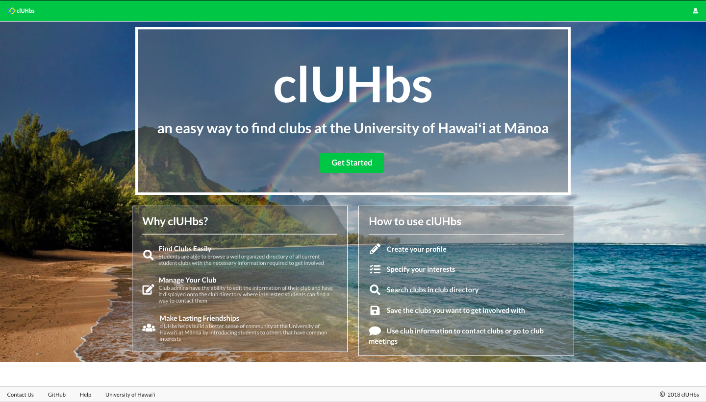

After you create an account, you can browse through the club directory page and favorite the clubs that interest them:

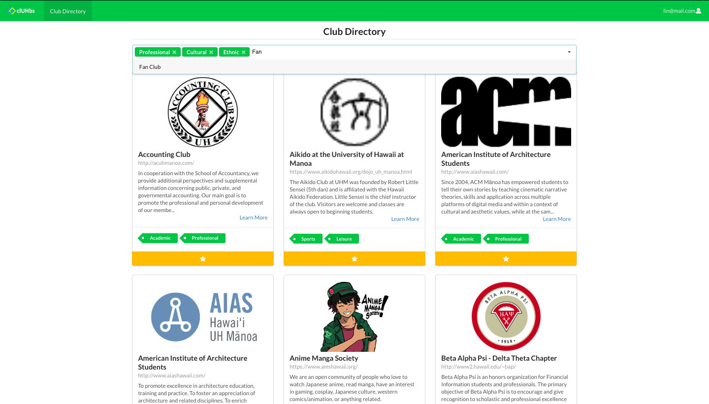

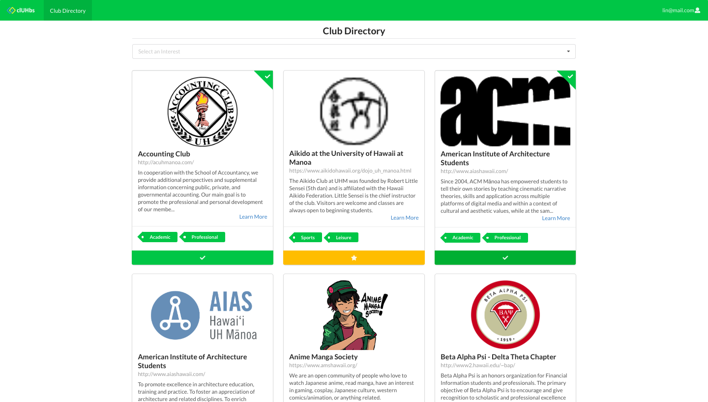

Users and club admins can create and edit a profile that provides their email, interest area, and favorite clubs:

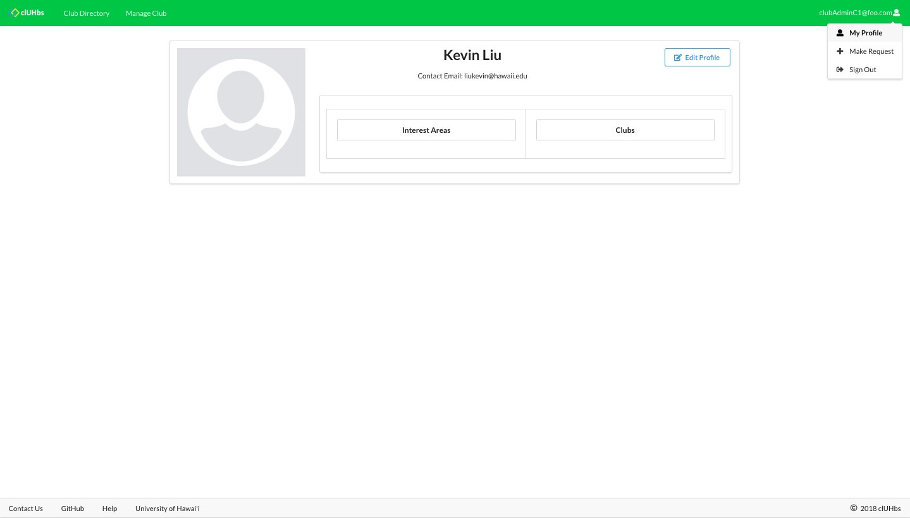

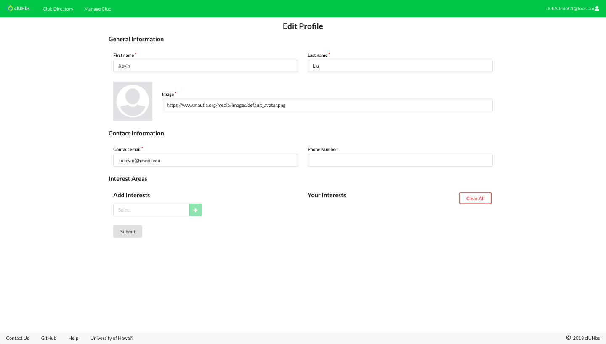

Registered users can request to be a Club Admin by submitting a request to the admin:

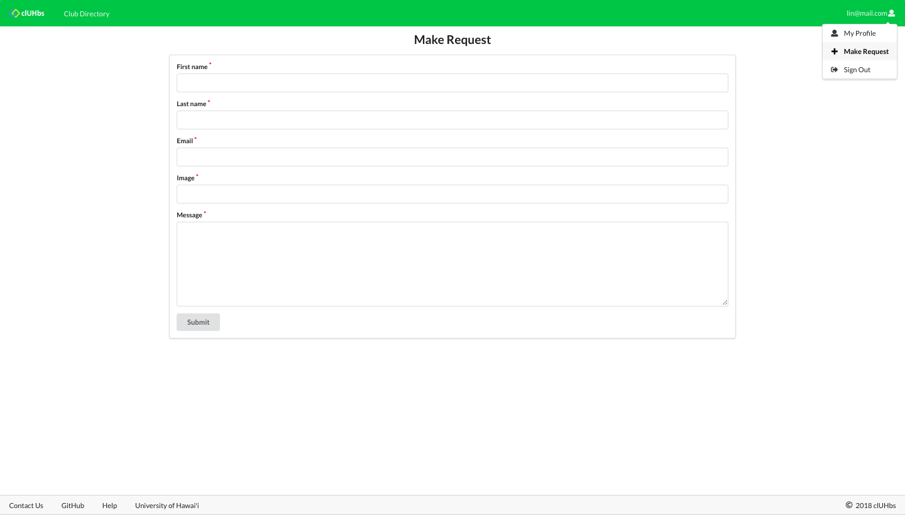

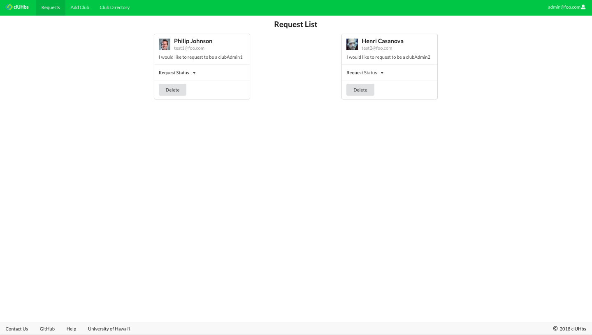

Only the club admins can add a new club by clicking the "Add Club" button from the Nav bar:


After your club is added, you can manage your club's information from the Manage Club page and click the "Edit" button:

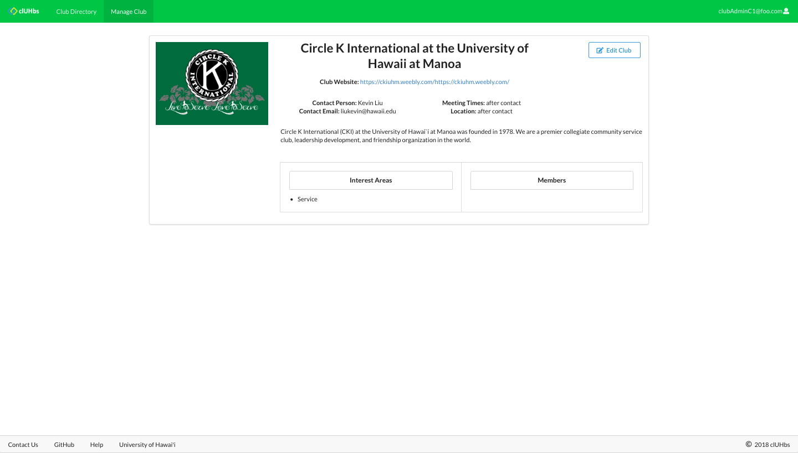

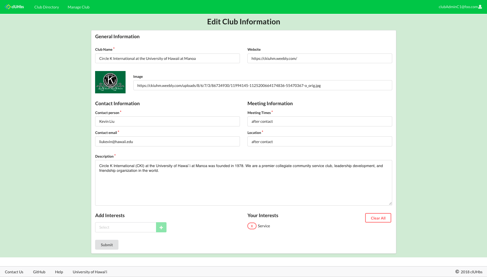

## Community Feedback

"I can't wait to join one of the clubs at UH. Now I know what and where I can find info about clubs." - Penny Ng, 13

"You made this? Whoah, that's nice. What's your grade in this class? It should be an A" - Jeff Swen, 17

"I like the design and the logo, looks a lot like UH. Simple and convenient." - Jaquelin Omota, 20

"I like that I can add my own club into the directory. Plus people don't need to have an account to see the clubs." - Abcde Kane, 20

"Did you guys actually make this? How long did it take you guys? I would definitely use this to find a club if I wasn't so busy with school." - Alex Leong, 19

## Installation

First, [install Meteor](https://www.meteor.com/install).

Second, [download a copy of clUHbs](https://github.com/cluhbs/cluhbs.github.io.git), or clone it using git.

Third, cd into the app/ directory and install the required libraries with:

```
$ meteor npm install
```

Once the libraries are installed, you can run the application by invoking:

```
$ meteor npm run start
```

The first time you run the app, it will create some default users and data.

If all goes well, the application will appear at [http://localhost:3000](http://localhost:3000).

Lastly, you can run ESLint over the code in the imports/ directory with:

```
$ meteor npm run lint
```

## Application Design

### Directory Structure

The top-level directory structure contains:

```
app/        # holds the Meteor application sources
config/     # holds configuration files, such as settings.developmen.json
.gitignore  # don't commit IntelliJ project files, node_modules, settings.production.json
```

This structure separates configuration files (such as the setting files) in the config/ directory from the actual Meteor application in the app/ directory.

The app/ directory has this top-level structure:

```
client/
  style.css      # holds CSS customizations
  main.html      # the <head>
  main.js        # import all the client-side html and js files.

imports/
  api/           # Define collection processing code (client + server side)
    club/   
    profile/
    request/
  startup/       # Define code to run when system starts up (client-only, server-only)
    both/
    client/        
    server/        
  ui/
    components/  # templates that appear inside a page template.
    layouts/     # Layouts contain common elements to all pages (i.e. menubar and footer)
    pages/       # Pages are navigated to by FlowRouter routes.

node_modules/    # managed by Meteor

public/          
  images/        # holds static images for landing page and predefined sample users.

server/
   main.js       # import all the server-side js files.
```

### Import Conventions

This system adheres to the Meteor 1.4 guideline of putting all application code in the imports/ directory, and using client/main.js and server/main.js to import the code appropriate for the client and server in an appropriate order.

This system accomplishes client and server-side importing in a different manner than most Meteor sample applications. In this system, every imports/ subdirectory containing any Javascript or HTML files has a top-level index.js file that is responsible for importing all files in its associated directory.

Then, client/main.js and server/main.js are responsible for importing all the directories containing code they need. For example, here is the contents of client/main.js:

```
import '/imports/startup/both';
import '../imports/startup/client';
import './style.css';
```

Apart from the last line that imports style.css directly, the other lines all invoke the index.js file in the specified directory.

We use this approach to make it simpler to understand what code is loaded and in what order, and to simplify debugging when some code or templates do not appear to be loaded. In our approach, there are only two places to look for top-level imports: the main.js files in client/ and server/, and the index.js files in import subdirectories.

Note that this two-level import structure ensures that all code and templates are loaded, but does not ensure that the symbols needed in a given file are accessible. So, for example, a symbol bound to a collection still needs to be imported into any file that references it.

### Naming conventions

This system adopts the following naming conventions:

* Files and directories are named in all lowercase, with words separated by hyphens. Example: accounts-config.js
* “Global” Javascript variables (such as collections) are all lowercase. Example: club.
* Other Javascript variables are camel-case. Example: collectionList.
* User interface pages and components are pascal-case, with combined words having a capitalized first letter. Example: ClubDirectory.
* Routes to pages are named similar to their corresponding page. Example: request-list.

## Data Model

The clUHbs data model is implemented by three Javascript classes: ClubCollection, ProfileCollection and RequestCollection. These classes encapsulate a MongoDB collection with the same name and export a single variable (Clubs, Profiles and Requests) that provides access to that collection.

Any part of the system that manipulates the clUHbs data model imports the Clubs, Profile or Request variable, and invokes methods of that class to get or set data.

## Routing

For display and navigation among the various pages, the application uses the Semantic Ui React router in react-router-dom and a Switch case.

Routing is performed in imports/ui/layouts/App.jsx.

clUHbs defines the following routes:

* The / route goes to the public landing page.
* The /signin route goes to the signin page.
* The /signup route goes to the register page.
* The /home route goes to the user's home page.
* The /list route goes to the club directory page.
* The /add route goes to the add a new club page, which is only accessed by accepted club admins.
* The /club-info/:id route goes to the club's profile page.
* The /club-edit/:id route goes to the club admin's edit club page.
* The /profile/:id route goes to the user's profile page.
* The /profile-edit/:id route goes to the profile edit page.
* The /make-request route goes to the request to be club admin page, which is only accessed by non-club admin users.
* The /admin route goes to the super admin's club directory page.
* The /request-admin route goes to the admin's home page, which is a list of request from users to be club admin.
* The /signout route goes to the signout page.

## Authorization

The landing and club directory pages are public; anyone can access those pages.

The super admin home page and super admin club directory pages require authorization and an 'admin' role: you must be logged in and have an account with the role of 'admin' (only one super admin is allowed to manage the site).

The club edit page and add club pages require authorization and a 'clubAdmin' role: you must be logged in and have an account with the role of 'clubAdmin' (only one club admin is allowed to be the owner of one club).

The rest of the pages are accessible by a regular user: you must be logged in with a registered account.

To prevent people from accessing pages they are not authorized to visit, authorization is implemented by creating a ProtectedRoute and AdminProtectedRoute functions in the App.jsx file to set the routing access to specified roles.

## Configuration

The config directory is intended to hold settings files. The repository contains one file: config/settings.development.json.

The .gitignore file prevents a file named settings.production.json from being committed to the repository. So, if you are deploying the application, you can put settings in a file named settings.production.json and it will not be committed.

clUHbs checks on startup to see if it has an empty database in initialize-database.js, and if so, loads the file specified in the configuration file, such as settings.development.json.

## Quality Assurance

### ESLint

clUHbs includes a .eslintrc file to define the coding style adhered to in this application. You can invoke ESLint from the command line as follows:

```
meteor npm run lint
```

ESLint should run without generating any errors.

It’s significantly easier to do development with ESLint integrated directly into your IDE (such as IntelliJ).

### Data model unit tests

To run the unit tests on the data model, invoke the script named ‘test’, which is defined in the package.json file:

```
meteor npm run test
```

This outputs the results to the console. Here is an example of a successful run, with timestamps removed:

```
[~/github/bowfolios/bowfolios/app]-> meteor npm run test

> bowfolios@ test /Users/philipjohnson/github/bowfolios/bowfolios/app
> TEST_WATCH=1 meteor test --driver-package meteortesting:mocha

[[[[[ Tests ]]]]]                             

=> Started proxy.                             
=> Started MongoDB.  

(STDERR) Note: you are using a pure-JavaScript implementation of bcrypt.
(STDERR) While this implementation will work correctly, it is known to be
(STDERR) approximately three times slower than the native implementation.
(STDERR) In order to use the native implementation instead, run
(STDERR)
(STDERR)   meteor npm install --save bcrypt
(STDERR)
(STDERR) in the root directory of your application.

 --------------------------------
 ----- RUNNING SERVER TESTS -----
 --------------------------------

=> Started your app.

=> App running at: http://localhost:3000/
    InterestCollection
    ✓ #define, #isDefined, #removeIt, #dumpOne, #restoreOne (69ms)
    ✓ #findID, #findIDs  
    ProfileCollection
    ✓ #define, #isDefined, #removeIt, #dumpOne, #restoreOne (66ms)
    ✓ #define (illegal interest)
    ✓ #define (duplicate interests)

   5 passing (178ms)

Load the app in a browser to run client tests, or set the TEST_BROWSER_DRIVER environment variable. See https://github.com/DispatchMe/meteor-mocha/blob/master/README.md#run-app-tests
```

### JSDoc

clUHbs supports documentation generation with JSDoc. The package.json file defines a script called jsdoc that runs JSDoc over the source files and outputs html to the ../../bowfolio.github.io/jsdoc directory.

## Development History
The development process for clUHbs conformed to [Issue Driven Project Management](http://courses.ics.hawaii.edu/ics314f16/modules/project-management/) practices. In a nutshell, development consists of a sequence of Milestones. Milestones consist of issues corresponding to 2-3 day tasks. GitHub projects are used to manage the processing of tasks during a milestone.

The following sections document the development history of clUHbs.

### Milestone 1: Mockup Development

Mockups for the following pages were implemented during M1:


Milestone 1 was implemented as [clUHbs GitHub Milestone M1](https://github.com/cluhbs/cluhbs/milestone/1):

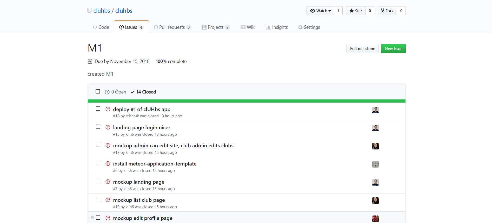

Milestone 1 consisted of 8 issues, and progress was managed via the [clUHbs GitHub Project M1](https://github.com/cluhbs/cluhbs/projects/1):


Each issue was implemented in its own branch, and merged into master when completed:

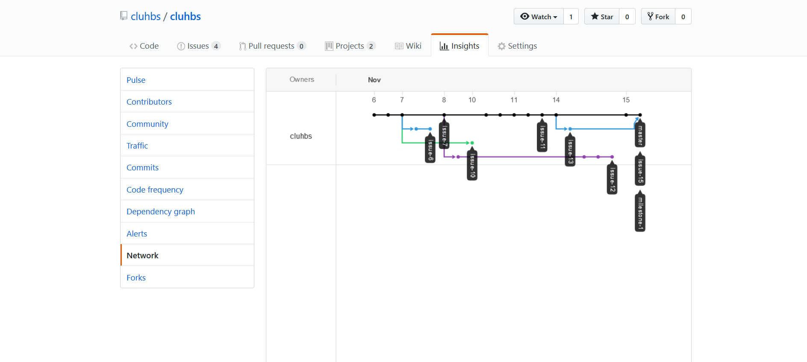

### Milestone 2: Functionality and Quality

The following pages were implemented during M2:


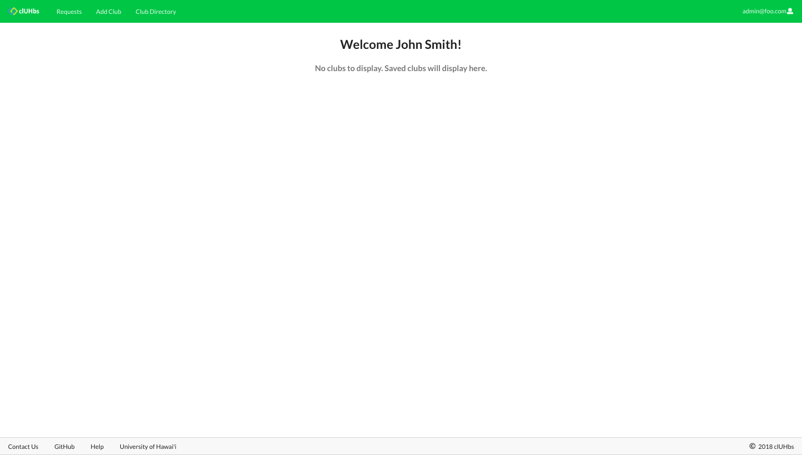


Milestone 2 was implemented as [clUHbs GitHub Milestone M2](https://github.com/cluhbs/cluhbs/milestone/2):

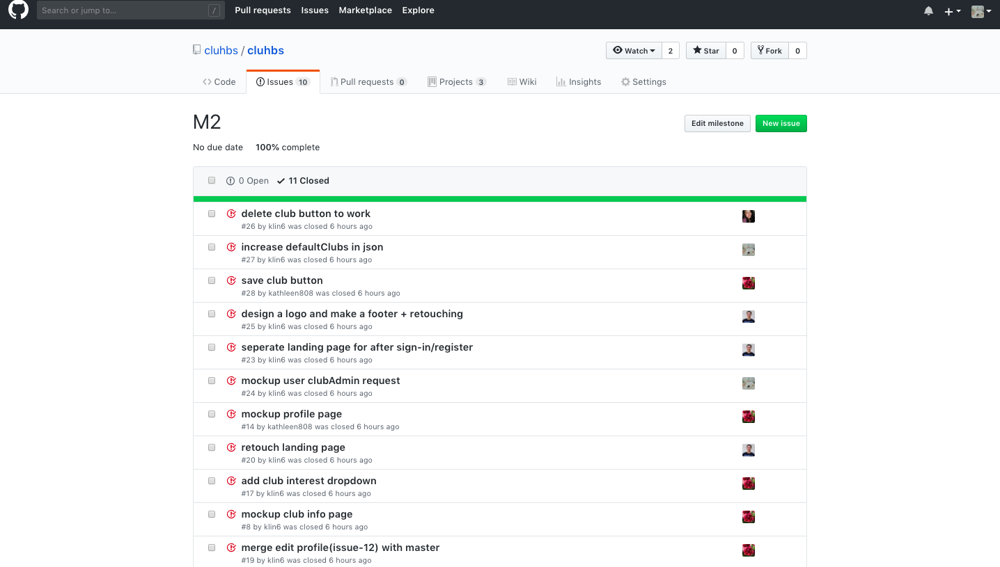

Milestone 2 consisted of 11 issues, and progress was managed via the [clUHbs GitHub Project M2](https://github.com/cluhbs/cluhbs/projects/2):

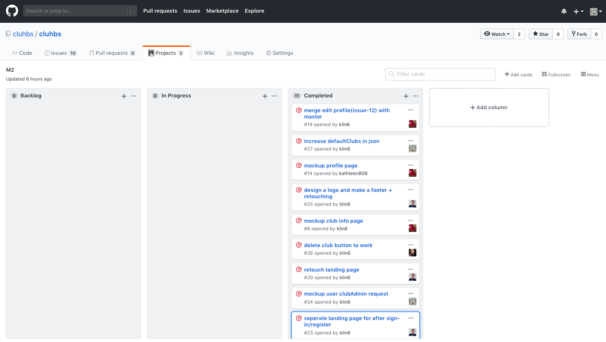

Each issue was implemented in its own branch, and merged into master when completed:

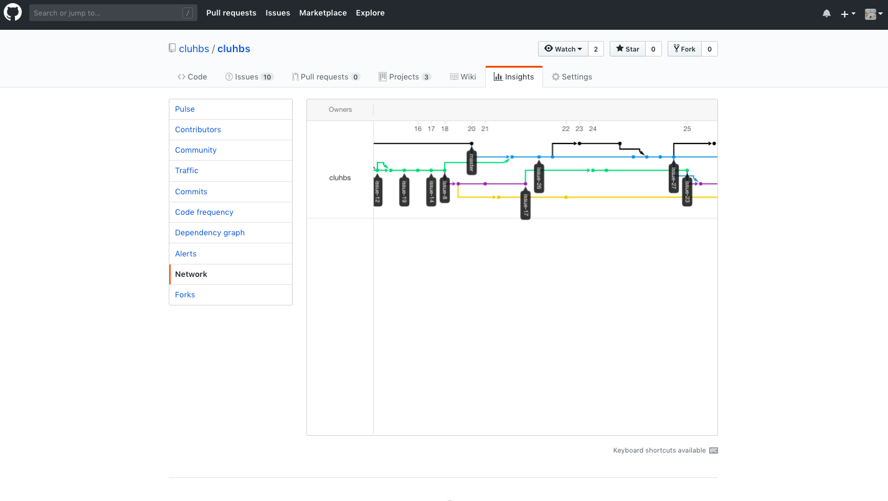

## Milestone 3: Improvements

The following pages and functionality advancements were implemented during M3:


Milestone 3 was implemented at [clUHbs GitHub Project M3](https://github.com/cluhbs/cluhbs/projects/3):


Milestone 3 consisted of 12 issues, and progress was managed via the [clUHbs GitHub Project M3](https://github.com/cluhbs/cluhbs/projects/3):


Each issue was implemented in its own branch, and merged into master when completed:

## Contact Us
Developers:
* Kathleen Dy (kdy3@hawaii.edu)
* Kylie Lin (link6@hawaii.edu)
* Leisha Soberano-Keawemauhili (leishask@hawaii.edu)
* Keanu Williams (kwill30@hawaii.edu)
