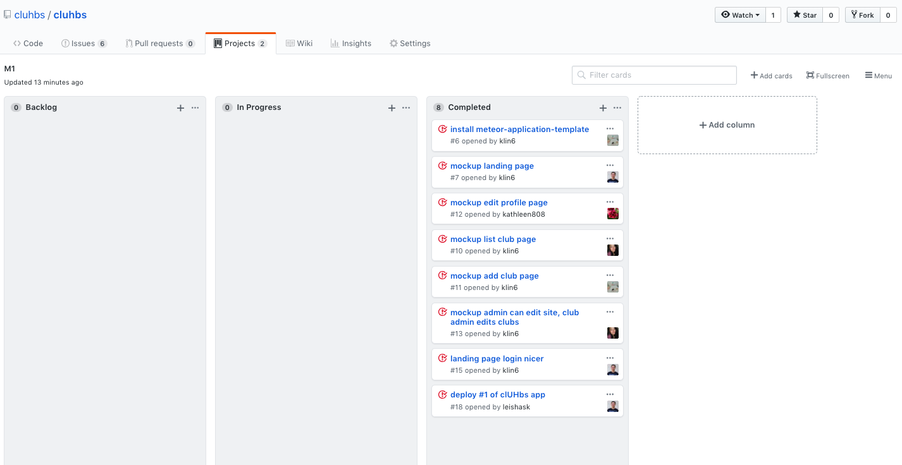

## About clUHbs
clUHbs is an application that provides a centralized directory for UH Manoa student clubs. UH Manoa students can login to browse a well organized directory of all current student clubs, with brief descriptions, meeting times and locations, URLs to their websites (if any), contact information for officers, and a few select photos.

(landing)

(create profile)

After you create an account, you can browse through the club directory page:


Only the club admins can add a new club by clicking the "Add Club" button from the Nav bar:


After your club is added, you can manage your club's information from the Manage Club page and click the "Edit" button:


## Installation

First, [install Meteor](https://www.meteor.com/install).

Second, [download a copy of clUHbs](https://github.com/cluhbs/cluhbs.github.io.git), or clone it using git.

Third, cd into the app/ directory and install the required libraries with:

```$ meteor npm install```

Once the libraries are installed, you can run the application by invoking:

```$ meteor npm run start```

The first time you run the app, it will create some default users and data.

If all goes well, the application will appear at [http://localhost:3000](http://localhost:3000).

Lastly, you can run ESLint over the code in the imports/ directory with:

```$ meteor npm run lint```

## Application Design
### Directory Structure
The top-level directory structure contains:
```
app/        # holds the Meteor application sources
config/     # holds configuration files, such as settings.developmen.json
.gitignore  # don't commit IntelliJ project files, node_modules, settings.production.json
```

This structure separates configuration files (such as the setting files) in the config/ directory from the actual Meteor application in the app/ directory.

The app/ directory has this top-level structure:
```
replace me
```

###Import conventions
This system adheres to the Meteor 1.4 guideline of putting all application code in the imports/ directory, and using client/main.js and server/main.js to import the code appropriate for the client and server in an appropriate order.

This system accomplishes client and server-side importing in a different manner than most Meteor sample applications. In this system, every imports/ subdirectory containing any Javascript or HTML files has a top-level index.js file that is responsible for importing all files in its associated directory.

Then, client/main.js and server/main.js are responsible for importing all the directories containing code they need. For example, here is the contents of client/main.js:
```
replace me
```

Apart from the last line that imports style.css directly, the other lines all invoke the index.js file in the specified directory.

We use this approach to make it simpler to understand what code is loaded and in what order, and to simplify debugging when some code or templates do not appear to be loaded. In our approach, there are only two places to look for top-level imports: the main.js files in client/ and server/, and the index.js files in import subdirectories.

Note that this two-level import structure ensures that all code and templates are loaded, but does not ensure that the symbols needed in a given file are accessible. So, for example, a symbol bound to a collection still needs to be imported into any file that references it.

### Naming conventions
This system adopts the following naming conventions:

* Files and directories are named in all lowercase, with words separated by hyphens. Example: accounts-config.js
* “Global” Javascript variables (such as collections) are capitalized. Example: Profiles.
* Other Javascript variables are camel-case. Example: collectionList.
* Templates representing pages are capitalized, with words separated by underscores. Example: Directory_Page. The files for this template are lower case, with hyphens rather than underscore. Example: directory-page.html, directory-page.js.
* Routes to pages are named the same as their corresponding page. Example: Directory_Page.

## Development History
The development process for clUHbs conformed to [Issue Driven Project Management](http://courses.ics.hawaii.edu/ics314f16/modules/project-management/) practices. In a nutshell, development consists of a sequence of Milestones. Milestones consist of issues corresponding to 2-3 day tasks. GitHub projects are used to manage the processing of tasks during a milestone.

The following sections document the development history of clUHbs.

### Milestone 1: Mockup Development

Mockups for the following pages were implemented during M1:


Milestone 1 was implemented as [clUHbs GitHub Milestone M1](https://github.com/cluhbs/cluhbs/milestone/1):

(screenshot of m1 milestone)

Milestone 1 consisted of ___ issues, and progress was managed via the [clUHbs GitHub Project M1](https://github.com/cluhbs/cluhbs/projects/1):



Each issue was implemented in its own branch, and merged into master when completed:

(screenshot of m1 graph)


## Contact Us
Developers:
* Kathleen Dy (kdy3@hawaii.edu)
* Kylie Lin (link6@hawaii.edu)
* Leisha Soberano-Keawemauhili (leishask@hawaii.edu)
* Keanu Williams (kwill30@hawaii.edu)
